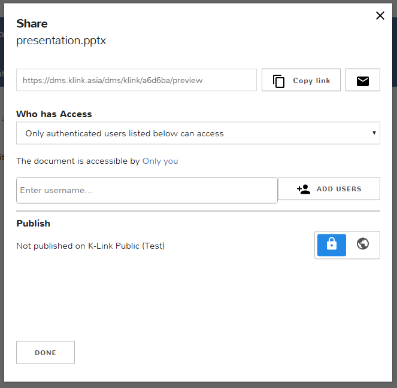
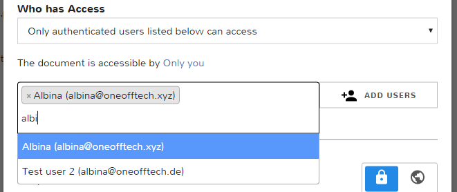
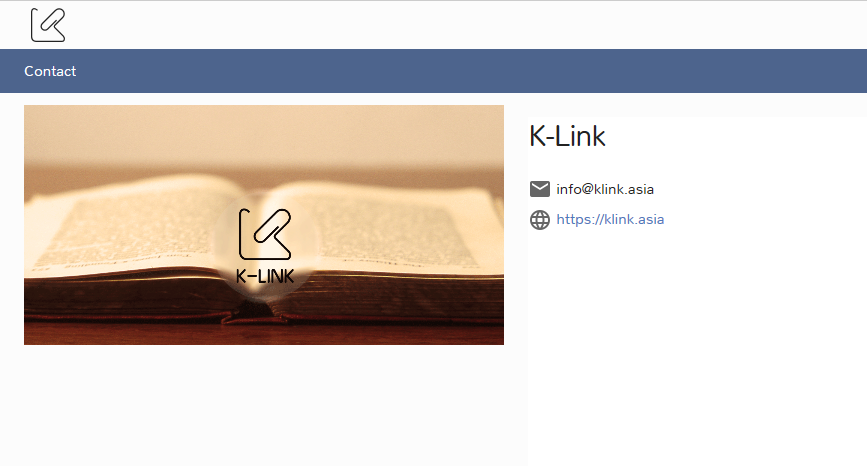
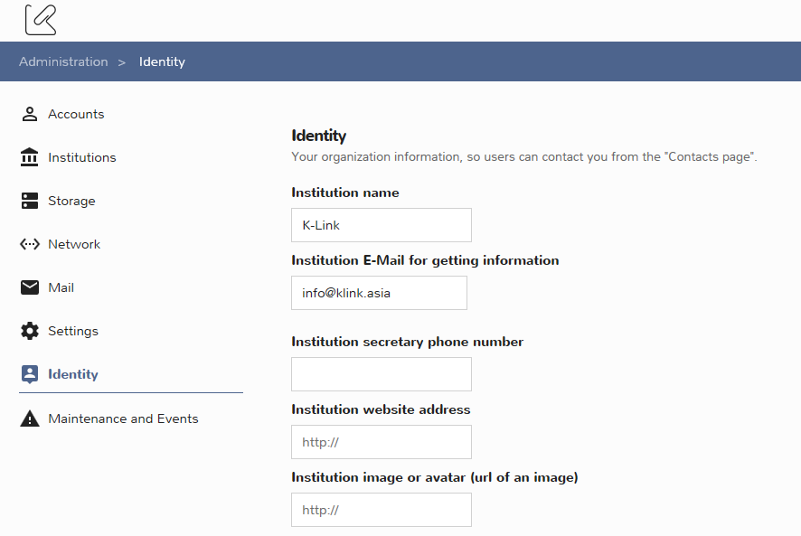
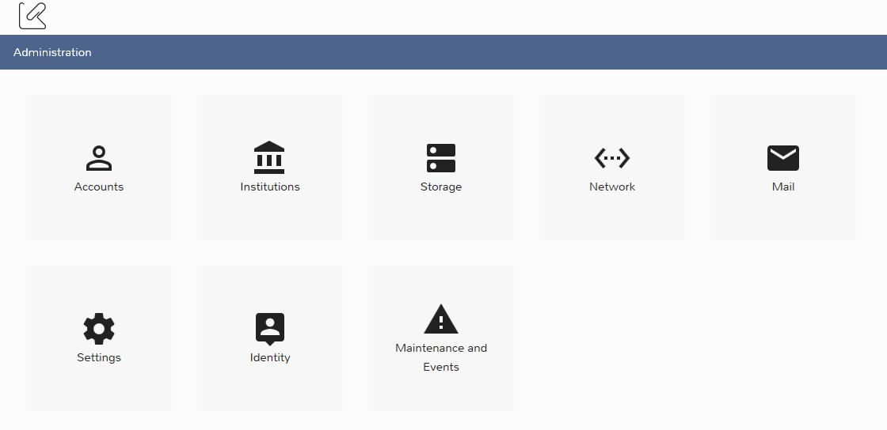

Welcome to the May 2017 release of the K-Box. There are a number of significant updates in this version that we hope you will like, some of the key highlights include:

- The starting of a new sharing experience
- Contact details configuration
- Cleaning up of the administration menu

### New sharing dialog

Sharing is a key part in managing document within a community. This release marks the starting point of a series of enhancements oriented to deliver a better sharing workflow.

Everything begins with a brand new sharing dialog.

The sharing dialog is organized in three major areas:

1. The direct document link for easy copy and paste
2. Who has access to the document
3. The publication on the K-Link Network

#### Document link

The direct link gives direct access to the preview of the document to authenticated users, by default. To speed up the link sharing, beside the ability to copy it, has been added the ability to compose an mail that contains the link. In this way you don't have to update the configured email application and copy/paste the link.

By default the link is private, that means only explicitly added users can see the document. Like in the previous sharing dialog you can select other users and explicitly share the document with them.

To select the users we added an autocomplete field. You can type both the username and the email of users. 
The suggestions will show-up below the field. You can select multiple users. Clicking _Add Users_ will share the document with those users.

#### Who has access to the document

All the users that has access to the document can be seen by clicking on the number on the right side of the label "The document is accessible by"

From that list you can also remove a previously added share to the document.

As said it is a first step, so please be patient when using the sharing dialog with multiple documents selected as there is some work still left to do.

#### Publication on the Network

Now the dialog contains, also, the status of the publication over the K-Link Network. The switch let's you publish and un-publish a document.

This option is available only to Project Managers and K-Linker users.

### Public Links

The new sharing dialog wouldn't be completed without the ability to decide whether the link you are copy and pasting is accessible by anyone or only by registered users.

If you pick the option _"Everybody with the link can access"_ everyone that receives the link to the document is able to see its preview.

You can always revert back your choice. In this case previous links are invalid and the users will be asked to enter a username and password.

### Contact information

In the perspective of giving you more control about the Organization information you share through the K-Box, we overhauled the contact information section. Now it shows only the information you want.

From the `Administration > Identity` page you can configure all the details that will be available on the K-Box contact page. To make it as easy as possible only the Organization name and contact email are required, all the other fields are optional.

### Administration menu cleanup

Information overloading is not what you expect from a document management system, that's why with this release we started to simply the administration menu and all the sections.

In particular we removed the language section, that was only listing the supported languages for localizing the User Interface.

### Other notable changes

- Share links are now shorter
- Fixed a bug that was preventing to show errors on the password reset page
- Fixed a bug that prevented the ability to reach the preview page of a   
  document if the link was inside a Word document
- Fixed a case that can prevent users to receive emails when messages are 
  sent through the "Send Message" feature
- Improved K-Box service startup time

