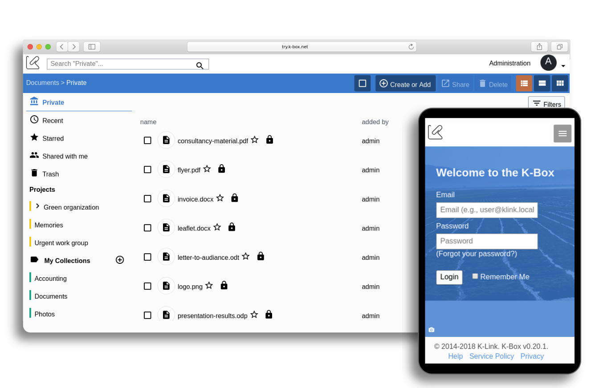

 

# K-Box

Web-based management system for documents and videos with a comfortable full content search. It connects easily to the K-Link services.

Please **[visit the website](http://k-link.technology)** for more information!

If you find any issues with this application, please report them at the [issue tracker](./issues). Contributions are both encouraged and appreciated. If you would like to contribute, please check the website for more information.

The upstream repository is at: https://github.com/k-box/k-box

## Installation

K-Box can be installed on most operating systems. The setup is heavily based on [Docker](https://www.docker.com/).

### Prerequisites

- Check the [system requirements](./docs/user/requirements.md).
- Use an operating system [supported by Docker](https://docs.docker.com/install/#server) (ideally GNU/Linux; we use [Debian](https://debian.org))
- Make sure you have installed the latest version of [Docker](https://docs.docker.com/install/linux/docker-ce/debian/) and [Docker Compose](https://docs.docker.com/compose/install/).

### Simplest installation

These few commands allow you to quickly install a K-Box **locally** on your computer for testing purposes.

* Create a directory: `mkdir k-box && cd k-box`
* Download configuration file: `curl -o docker-compose.yml https://raw.githubusercontent.com/k-box/k-box/master/docker-compose.example.yml`
* Start up services: `docker-compose up -d` (when running this for the first time, it will download a lot of data and take a while)
* Create the administrator: `docker-compose exec kbox php artisan create-admin admin@kbox.local` 
* Visit your K-Box: [http://localhost:8080](http://localhost:8080/) (you can login to the K-Box with the username `admin@kbox.local` and the chosen password).

For installation on a server in the Internet or more configuration options, see the documentation on [installation of the K-Box](./docs/user/installation.md).

## Components

The K-Box consists of different components:

| Name | Image | Based on | Description |
|------|-------|----------|-------------|
| [K-Box](./docs/website.md) application | `kbox` | PHP and Laravel 5 | The interface of the knowledge management system |
| [K-Search API](https://github.com/k-box/k-search) | `ksearch` | PHP and Symfony 4 | Full text search component used for K-Link and K-Box |
| [K-Search Engine](https://github.com/k-box/k-search-engine) | `engine` | Apache SOLR | Open Source search engine pre-configured for the K-Search |
| Database | `database` | MariaDB | A database for the use of the K-Box web application. |

## Development

Programmers may check out the [developers documentation](./docs/developer/index.md)

## Testing

The K-Box code is covered by unit tests. For more information see [Executing Unit Tests](./docs/developer/testing.md).

## License

This program is Free Software: You can use, study, share and improve it at your will. Specifically you can redistribute and/or modify it under the terms of the [GNU Affero General Public License](./LICENSE.txt) version 3 as published by the Free Software Foundation.

**Your contribution is very welcome**. Find more information in our [contribution guide](./contributing.md).
